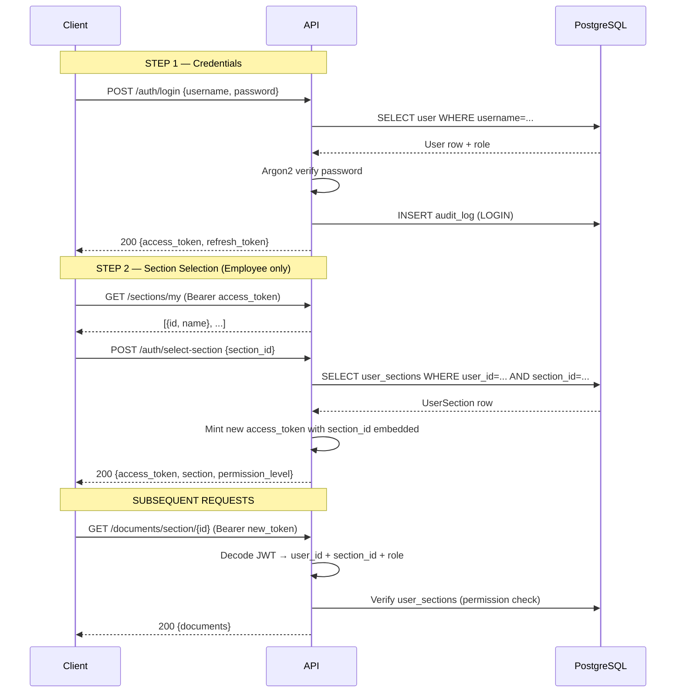
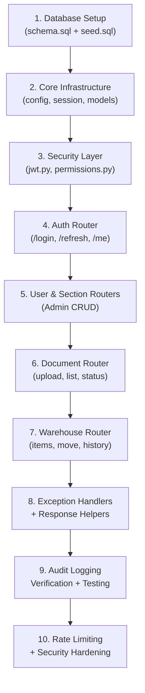

# Factory Management System — Backend Architecture & API Design

> **Stack:** FastAPI · PostgreSQL · SQLAlchemy 2.x (async) · JWT · Argon2id  
> **Base URL:** `https://api.factory.local/api/v1`

---

## 1. Project Architecture

```
backend/
├── app/
│   ├── main.py                  ← FastAPI app, middleware, router registration
│   │
│   ├── core/
│   │   └── config.py            ← Pydantic Settings (env vars)
│   │
│   ├── database/                ← (alias for db/)
│   ├── db/
│   │   └── session.py           ← Async engine, AsyncSession, get_db() dependency
│   │
│   ├── models/
│   │   └── models.py            ← SQLAlchemy ORM models (all 9 tables)
│   │
│   ├── schemas/
│   │   └── schemas.py           ← Pydantic v2 request/response models + API envelope
│   │
│   ├── routers/
│   │   ├── auth.py              ← /auth endpoints
│   │   ├── users.py             ← /users endpoints (Admin)
│   │   ├── sections.py          ← /sections endpoints
│   │   ├── documents.py         ← /documents endpoints
│   │   └── warehouse.py         ← /warehouse endpoints
│   │
│   ├── services/
│   │   └── audit_service.py     ← log_event() helper (shared across all routers)
│   │
│   ├── security/
│   │   ├── jwt.py               ← Argon2 hashing, JWT create/decode, role dependency
│   │   └── permissions.py       ← Section-level permission dependency factory
│   │
│   └── utils/
│       ├── responses.py         ← success_response(), error_response(), paginated_response()
│       └── exceptions.py        ← Global exception handlers
│
├── alembic/
│   └── env.py                   ← Async Alembic migration config
├── requirements.txt
└── .env.example
```

### Folder Responsibilities

| Folder | Responsibility |
|--------|----------------|
| `core/` | App-level configuration — single source of truth for all settings |
| `db/` | Database connection, async session factory, FastAPI `get_db` dependency |
| `models/` | SQLAlchemy ORM — mirrors the PostgreSQL schema exactly |
| `schemas/` | Pydantic v2 contracts — what goes IN and OUT of every endpoint |
| `routers/` | HTTP layer — routes, request parsing, calls services, returns responses |
| `services/` | Business logic that is shared across multiple routers |
| `security/` | Authentication (JWT) and authorization (permissions) — zero business logic here |
| `utils/` | Pure helpers — response formatting and error handling |

---

## 2. Authentication & Authorization Design

### 2-Step Login Flow (Employee)



### Admin Flow (no section selection required)
Admin receives a fully privileged token at step 1. The `section_id` claim is absent; the `require_section_permission` dependency grants admin bypass.

---

## 3. API Contract

### 3.1 Authentication — `/auth`

---

#### `POST /auth/login`

**Purpose:** Verify credentials and issue a token pair.

**Request:**
```json
{
  "username": "ahmed_ali",
  "password": "Employee@1234"
}
```

**Response `200`:**
```json
{
  "status": "success",
  "data": {
    "access_token": "<JWT>",
    "refresh_token": "<JWT>",
    "token_type": "bearer",
    "expires_in": 1800
  }
}
```

**Response `401`:**
```json
{ "status": "error", "message": "Invalid username or password", "code": "UNAUTHORIZED" }
```

**Auth:** None (public)  
**Side effects:** Writes `LOGIN` audit log; updates `last_login`

---

#### `POST /auth/select-section`

**Purpose:** Embed `section_id` into a new access token for an employee.

**Auth:** Bearer access_token (Employee)

**Request:**
```json
{ "section_id": "uuid" }
```

**Response `200`:**
```json
{
  "status": "success",
  "data": {
    "access_token": "<new JWT with section_id embedded>",
    "token_type": "bearer",
    "section": { "id": "uuid", "name": "Warehouse" },
    "permission_level": "WRITE"
  }
}
```

---

#### `POST /auth/refresh`

**Purpose:** Use a refresh token to get a new access token silently.

**Auth:** None (refresh token in body)

**Request:**
```json
{ "refresh_token": "<JWT>" }
```

**Response `200`:**
```json
{
  "status": "success",
  "data": {
    "access_token": "<new JWT>",
    "refresh_token": "<rotated JWT>",
    "token_type": "bearer",
    "expires_in": 1800
  }
}
```

---

#### `GET /auth/me`

**Purpose:** Return the profile of the currently authenticated user.

**Auth:** Bearer access_token (any role)

**Response `200`:**
```json
{
  "status": "success",
  "data": {
    "id": "uuid",
    "username": "ahmed_ali",
    "email": "ahmed.ali@factory.local",
    "full_name": "Ahmed Ali",
    "role": "EMPLOYEE",
    "is_active": true,
    "last_login": "2026-06-20T13:00:00Z"
  }
}
```

---

### 3.2 User Management — `/users` *(Admin only)*

---

#### `GET /users`

**Purpose:** Paginated list of all users.

**Query params:** `page=1`, `page_size=20`

**Response `200`:**
```json
{
  "status": "success",
  "data": [{ "id": "...", "username": "...", "role": {...}, "is_active": true }],
  "total": 42,
  "page": 1,
  "page_size": 20
}
```

---

#### `POST /users`

**Purpose:** Create a new user.

**Request:**
```json
{
  "username": "sara_tech",
  "email": "sara@factory.local",
  "password": "Sara@5678",
  "full_name": "Sara Techworks",
  "role_id": "uuid-of-EMPLOYEE-role"
}
```

**Validation rules:**
- `username`: min 3 chars
- `password`: min 8 chars, ≥1 uppercase, ≥1 digit
- `email`: valid email format
- `role_id`: must exist in `roles` table

**Response `201`:** Full `UserOut` object.

---

#### `PATCH /users/{id}`

**Purpose:** Update email, full_name, or role.

**Request (partial):**
```json
{ "full_name": "Sara T. Updated", "role_id": "uuid" }
```

---

#### `PATCH /users/{id}/block`

**Purpose:** Enable or disable a user account.

**Request:**
```json
{ "is_active": false }
```

**Response `200`:**
```json
{ "status": "success", "data": { "id": "uuid", "is_active": false } }
```

> [!WARNING]
> An admin cannot block their own account.

---

#### `DELETE /users/{id}`

**Purpose:** Permanently delete a user.

**Response:** `204 No Content`

> [!WARNING]
> Audit logs for the deleted user are **preserved** (`ON DELETE SET NULL`).

---

### 3.3 Sections — `/sections`

| Endpoint | Auth | Description |
|----------|------|-------------|
| `GET /sections` | Any authenticated | List all sections |
| `GET /sections/my` | Employee | Only sections user has access to |
| `POST /sections` | Admin | Create section |
| `DELETE /sections/{id}` | Admin | Delete section |
| `POST /sections/assign` | Admin | Assign user to section with permission |
| `DELETE /sections/assign/{id}` | Admin | Revoke section access |

**Assign Request:**
```json
{
  "user_id": "uuid",
  "section_id": "uuid",
  "permission_level": "WRITE"
}
```

---

### 3.4 SOP Documents — `/documents`

---

#### `GET /documents/section/{section_id}`

**Purpose:** List all non-archived documents in a section.  
**Auth:** Bearer token with matching `section_id` claim (READ+)

**Response `200`:**
```json
{
  "status": "success",
  "data": [
    {
      "id": "uuid",
      "title": "SOP-PRD-001: Machine Startup",
      "version": "1.0",
      "status": "APPROVED",
      "uploader_name": "System Administrator",
      "created_at": "2026-06-20T10:00:00Z"
    }
  ]
}
```

---

#### `POST /documents`

**Purpose:** Upload a new SOP document.  
**Auth:** Admin only  
**Content-Type:** `multipart/form-data`

**Form fields:**
| Field | Type | Required |
|-------|------|----------|
| `section_id` | UUID | ✅ |
| `title` | string | ✅ |
| `description` | string | ❌ |
| `version` | string (x.y) | ❌ (default: 1.0) |
| `file` | file | ✅ |

**File validation:**
- Allowed types: `pdf`, `docx`, `xlsx`, `pptx`, `txt`
- Max size: 20 MB

**Response `201`:** Full `DocumentOut` object.

---

#### `GET /documents/{id}`

**Purpose:** Retrieve a document's metadata. Automatically logs `OPEN_DOCUMENT`.  
**Auth:** Any authenticated user.

---

#### `PATCH /documents/{id}/status`

**Purpose:** Transition document lifecycle state.  
**Auth:** Admin only

**Query param:** `?new_status=APPROVED`

**Valid transitions:**
```
DRAFT → UNDER_REVIEW → APPROVED → ARCHIVED
UNDER_REVIEW → REJECTED
```

---

#### `DELETE /documents/{id}`

**Purpose:** Delete document record + remove file from storage.  
**Auth:** Admin only  
**Response:** `204 No Content`

---

#### `GET /documents/{id}/logs`

**Purpose:** Full audit trail for a specific document.  
**Auth:** Admin only

**Response `200`:**
```json
{
  "status": "success",
  "data": [
    {
      "id": "uuid",
      "action": "OPEN_DOCUMENT",
      "user_id": "uuid",
      "description": "Opened document: 'SOP-PRD-001' v1.0",
      "ip_address": "192.168.1.42",
      "created_at": "2026-06-20T12:00:00Z"
    }
  ]
}
```

---

### 3.5 Warehouse — `/warehouse`

---

#### `GET /warehouse/items/{item_code}`

**Purpose:** Barcode-scan lookup — get item details by code.  
**Auth:** Section READ permission

**Response `200`:**
```json
{
  "status": "success",
  "data": {
    "id": "uuid",
    "item_code": "BG-000001",
    "material_name": "Polymer Granules",
    "quantity": 50.0,
    "unit": "KG",
    "location": { "location_code": "A-R01-S03-P05", ... },
    "status": "AVAILABLE"
  }
}
```

---

#### `POST /warehouse/items`

**Purpose:** Register a new item in the warehouse.  
**Auth:** Section WRITE permission

**Request:**
```json
{
  "item_code": "BG-000124",
  "material_name": "Polymer Granules Grade B",
  "quantity": 75.0,
  "unit": "KG",
  "location_id": "uuid"
}
```

**Validation:**
- `item_code` must match `^[A-Z]{2}-\d{6}$`
- `quantity` ≥ 0
- `location_id` must exist
- `item_code` must be globally unique

**Side effects:** Creates a `movement_log` entry (initial placement).

---

#### `POST /warehouse/items/{id}/move`

**Purpose:** Move an item to a new location.  
**Auth:** Section WRITE permission

**Request:**
```json
{
  "to_location_id": "uuid",
  "notes": "Moved for production run PR-2026-07"
}
```

**Validation:**
- `to_location_id` must exist
- Must differ from current location

**Side effects:**
- Creates `movement_log` entry
- Updates `items.location_id`
- Writes `MOVE_ITEM` audit log

---

#### `GET /warehouse/items/{id}/history`

**Purpose:** Full movement trail for an item.  
**Auth:** Section READ permission

**Response `200`:**
```json
{
  "status": "success",
  "data": [
    {
      "id": "uuid",
      "from_location": { "location_code": "A-R01-S01-P01" },
      "to_location": { "location_code": "A-R01-S03-P05" },
      "moved_by": "uuid",
      "mover_name": "Ahmed Ali",
      "notes": "Relocated to polymer area",
      "created_at": "2026-06-20T11:00:00Z"
    }
  ]
}
```

---

## 4. Authorization Middleware Chain

```
Request
  │
  ▼
[CORS Middleware]            ← Block disallowed origins
  │
  ▼
[Rate Limit Middleware]      ← 200 req/min per IP (slowapi)
  │
  ▼
[Router Handler]
  │
  ▼
[get_current_token()]        ← Decode Bearer JWT → raise 401 if invalid/expired
  │
  ▼
[require_role("ADMIN")]      ← Check role claim → raise 403 if insufficient
  OR
[require_section_permission(READ)]
  │  1. Extract user_id + section_id from JWT
  │  2. SELECT user_sections WHERE user_id=... AND section_id=...
  │  3. Compare permission_level to required level
  │  4. Raise 403 if missing or insufficient
  ▼
[Business Logic / DB Query]
  │
  ▼
[log_event() in same transaction]
  │
  ▼
[get_db() commits transaction]
  │
  ▼
Response
```

---

## 5. Audit Logging Strategy

| Event | Action Enum | Module | Where logged |
|-------|-------------|--------|--------------|
| Successful login | `LOGIN` | `IAM` | `auth.py → login()` |
| Failed login | `LOGIN` | `IAM` | `auth.py → login()` |
| User created | `CREATE` | `IAM` | `users.py → create_user()` |
| User blocked | `UPDATE` | `IAM` | `users.py → block_user()` |
| User deleted | `DELETE` | `IAM` | `users.py → delete_user()` |
| Document opened | `OPEN_DOCUMENT` | `SOP` | `documents.py → get_document()` |
| Document uploaded | `UPLOAD_DOCUMENT` | `SOP` | `documents.py → upload_document()` |
| Document deleted | `DELETE` | `SOP` | `documents.py → delete_document()` |
| Item added | `ADD_ITEM` | `WAREHOUSE` | `warehouse.py → create_item()` |
| Item moved | `MOVE_ITEM` | `WAREHOUSE` | `warehouse.py → move_item()` |

> [!IMPORTANT]
> All `log_event()` calls happen **within the same database transaction** as the main operation.
> If the main operation fails and rolls back, the audit log entry rolls back too — ensuring consistency.

---

## 6. Error Handling

### Standard Response Envelope

**Success:**
```json
{
  "status": "success",
  "data": { }
}
```

**Error:**
```json
{
  "status": "error",
  "message": "Human-readable description",
  "code": "MACHINE_READABLE_CODE"
}
```

### HTTP Status Code Reference

| Code | `code` field | When used |
|------|-------------|-----------|
| `200 OK` | — | Successful GET / PATCH |
| `201 Created` | — | Successful POST |
| `204 No Content` | — | Successful DELETE |
| `400 Bad Request` | `BAD_REQUEST` | Invalid logic (e.g., move to same location) |
| `401 Unauthorized` | `UNAUTHORIZED` | Missing/invalid/expired JWT |
| `403 Forbidden` | `FORBIDDEN` | Valid token, insufficient permissions |
| `404 Not Found` | `NOT_FOUND` | Entity doesn't exist |
| `409 Conflict` | `CONFLICT` | Duplicate username/email/item_code |
| `413` | `PAYLOAD_TOO_LARGE` | File exceeds size limit |
| `415` | `UNSUPPORTED_MEDIA_TYPE` | Disallowed file extension |
| `422 Unprocessable` | `VALIDATION_ERROR` | Pydantic validation failure |
| `429 Too Many Requests` | `RATE_LIMIT_EXCEEDED` | Rate limit hit |
| `500 Internal Error` | `INTERNAL_SERVER_ERROR` | Unhandled exception |

---

## 7. File Storage Strategy

### MVP — Local Disk
```
uploads/
└── documents/
    └── <section_name>/
        └── <uuid>_<original_filename>.<ext>
```
- Files stored under `uploads/documents/<section>/`
- UUIDs prepended to prevent collisions and path traversal
- `file_path` in DB stores the relative path

### Production — Object Storage (Recommended)
```python
# Swap _save_file() in documents.py with:
import boto3

s3 = boto3.client("s3")
key = f"documents/{section_name}/{uuid4()}_{filename}"
s3.put_object(Bucket="factory-sop", Key=key, Body=content)
# Store key as file_path in DB
```

**Pre-signed URLs** for secure downloads without exposing the bucket.

---

## 8. Security Checklist

| Requirement | Implementation |
|---|---|
| Password hashing | Argon2id via `argon2-cffi` (time_cost=2, memory_cost=64MB) |
| JWT access tokens | HS256, 30-minute expiry, `jti` claim for future revocation |
| JWT refresh tokens | Separate secret key, 7-day expiry, rotated on use |
| Role-based access | `require_role()` dependency factory |
| Section-level access | `require_section_permission()` — queries `user_sections` table |
| Rate limiting | `slowapi` — 200 req/min per IP on all endpoints |
| SQL injection | SQLAlchemy ORM with parameterised queries — no raw SQL |
| File upload safety | Extension allowlist + size limit (20 MB) + UUID rename |
| CORS | Explicit `allow_origins` whitelist in `CORSMiddleware` |
| Sensitive env vars | `pydantic-settings` reads from `.env` file — never hardcoded |
| Audit trail | Every mutating action writes to `audit_logs` atomically |

---

## 9. Recommended Implementation Order (MVP)



| Phase | Task | Est. Time |
|-------|------|-----------|
| 1 | DB + seed | ✅ Done |
| 2 | SQLAlchemy models + session | ✅ Done |
| 3 | JWT + Argon2 security | ✅ Done |
| 4 | Auth endpoints | ✅ Done |
| 5 | User + Section management | ✅ Done |
| 6 | Document upload + lifecycle | ✅ Done |
| 7 | Warehouse CRUD + movements | ✅ Done |
| 8 | Error handling | ✅ Done |
| 9 | Integration tests | Next step |
| 10 | Docker + nginx + prod config | After tests |
