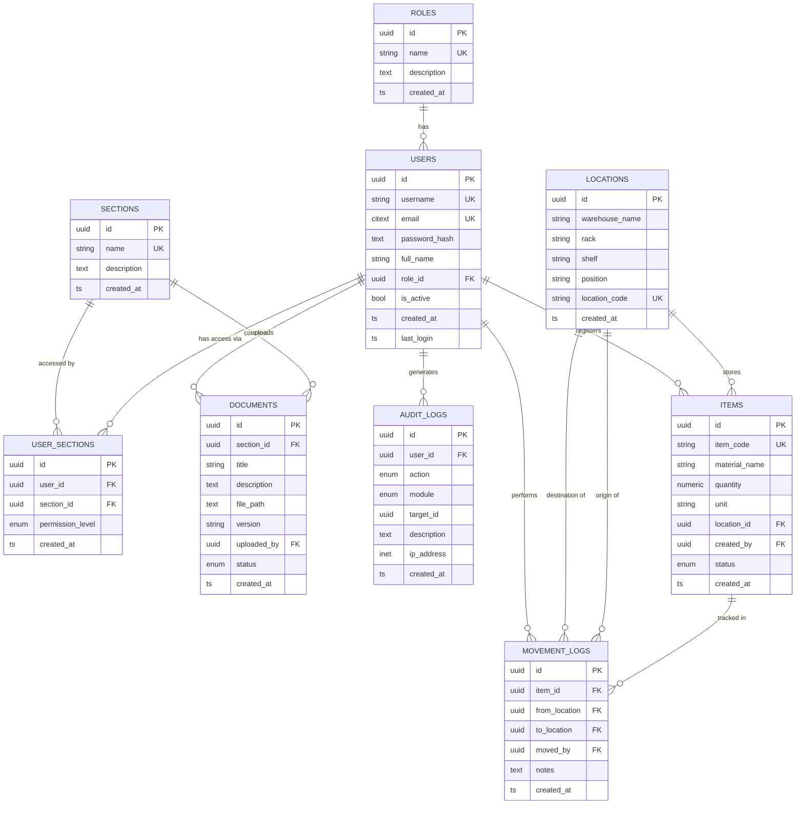

# Factory Management System — Database Design Document

> **Stack:** PostgreSQL 15+ · SQLAlchemy 2.x (async) · FastAPI · Alembic  
> **Generated:** 2026-06-20

---

## 1. Entity Relationship Diagram (ERD)



---

## 2. Module Overview

| Module | Tables | Purpose |
|--------|--------|---------|
| **Identity & Access Management** | `roles`, `users`, `sections`, `user_sections` | Authentication, RBAC, per-section access |
| **SOP Document Management** | `documents`, `audit_logs` | Versioned SOP lifecycle + immutable audit trail |
| **Warehouse Management** | `locations`, `items`, `movement_logs` | Physical inventory tracking & movement history |

---

## 3. Table Definitions

### 3.1 `roles`
| Column | Type | Constraint |
|--------|------|------------|
| `id` | `UUID` | PK, default `gen_random_uuid()` |
| `name` | `VARCHAR(50)` | NOT NULL, UNIQUE |
| `description` | `TEXT` | nullable |
| `created_at` | `TIMESTAMPTZ` | NOT NULL, default `NOW()` |

**Seed roles:** `ADMIN`, `EMPLOYEE`

---

### 3.2 `users`
| Column | Type | Constraint |
|--------|------|------------|
| `id` | `UUID` | PK |
| `username` | `VARCHAR(50)` | NOT NULL, UNIQUE, min 3 chars |
| `email` | `CITEXT` | NOT NULL, UNIQUE, regex validated |
| `password_hash` | `TEXT` | NOT NULL, min 60 chars (bcrypt/argon2) |
| `full_name` | `VARCHAR(150)` | nullable |
| `role_id` | `UUID` | FK → `roles.id` RESTRICT |
| `is_active` | `BOOLEAN` | NOT NULL, default `TRUE` |
| `created_at` | `TIMESTAMPTZ` | NOT NULL |
| `last_login` | `TIMESTAMPTZ` | nullable |

> [!IMPORTANT]
> **Plain-text passwords are NEVER stored.** Use bcrypt or argon2id hashing in your auth layer.

**Indexes:** `username`, `email`, `role_id`, partial index on `is_active = TRUE`

---

### 3.3 `sections`
| Column | Type | Constraint |
|--------|------|------------|
| `id` | `UUID` | PK |
| `name` | `VARCHAR(100)` | NOT NULL, UNIQUE |
| `description` | `TEXT` | nullable |
| `created_at` | `TIMESTAMPTZ` | NOT NULL |

**Seed sections:** `Production`, `Labs`, `Warehouse`, `Quality`

---

### 3.4 `user_sections` *(M:N junction)*
| Column | Type | Constraint |
|--------|------|------------|
| `id` | `UUID` | PK |
| `user_id` | `UUID` | FK → `users.id` CASCADE |
| `section_id` | `UUID` | FK → `sections.id` CASCADE |
| `permission_level` | `ENUM` | `READ \| WRITE \| ADMIN`, default `READ` |
| `created_at` | `TIMESTAMPTZ` | NOT NULL |

**Unique constraint:** `(user_id, section_id)`

---

### 3.5 `documents`
| Column | Type | Constraint |
|--------|------|------------|
| `id` | `UUID` | PK |
| `section_id` | `UUID` | FK → `sections.id` RESTRICT |
| `title` | `VARCHAR(255)` | NOT NULL |
| `description` | `TEXT` | nullable |
| `file_path` | `TEXT` | NOT NULL (object-storage key / path) |
| `version` | `VARCHAR(20)` | NOT NULL, regex `^\d+\.\d+(\.\d+)?$` |
| `uploaded_by` | `UUID` | FK → `users.id` RESTRICT |
| `status` | `ENUM` | `DRAFT → UNDER_REVIEW → APPROVED → ARCHIVED/REJECTED` |
| `created_at` | `TIMESTAMPTZ` | NOT NULL |

> [!TIP]
> To support **document versioning**, create a new row for each new version. Query `ORDER BY version DESC` or use a `latest_version` view.

---

### 3.6 `audit_logs`
| Column | Type | Constraint |
|--------|------|------------|
| `id` | `UUID` | PK |
| `user_id` | `UUID` | FK → `users.id` SET NULL (preserve logs) |
| `action` | `ENUM` | 14 actions across all modules |
| `module` | `ENUM` | `IAM \| SOP \| WAREHOUSE \| SYSTEM` |
| `target_id` | `UUID` | nullable — any affected entity |
| `description` | `TEXT` | nullable |
| `ip_address` | `INET` | nullable (PostgreSQL native INET) |
| `created_at` | `TIMESTAMPTZ` | NOT NULL |

> [!NOTE]
> Audit logs are **append-only** by convention. Add a `REVOKE UPDATE, DELETE ON audit_logs FROM app_role;` grant in production.

---

### 3.7 `locations`
| Column | Type | Constraint |
|--------|------|------------|
| `id` | `UUID` | PK |
| `warehouse_name` | `VARCHAR(100)` | NOT NULL |
| `rack` | `VARCHAR(20)` | NOT NULL |
| `shelf` | `VARCHAR(20)` | NOT NULL |
| `position` | `VARCHAR(20)` | NOT NULL |
| `location_code` | `VARCHAR(50)` | NOT NULL, UNIQUE, regex validated |
| `created_at` | `TIMESTAMPTZ` | NOT NULL |

**Code format:** `WAREHOUSE-RACK-SHELF-POSITION` (e.g., `A-R01-S03-P05`)

---

### 3.8 `items`
| Column | Type | Constraint |
|--------|------|------------|
| `id` | `UUID` | PK |
| `item_code` | `VARCHAR(20)` | NOT NULL, UNIQUE, regex `^[A-Z]{2}-\d{6}$` |
| `material_name` | `VARCHAR(200)` | NOT NULL |
| `quantity` | `NUMERIC(12,3)` | NOT NULL, ≥ 0 |
| `unit` | `VARCHAR(20)` | NOT NULL (KG, L, PCS, BOX…) |
| `location_id` | `UUID` | FK → `locations.id` RESTRICT |
| `created_by` | `UUID` | FK → `users.id` RESTRICT |
| `status` | `ENUM` | `AVAILABLE \| RESERVED \| CONSUMED \| DAMAGED \| QUARANTINE` |
| `created_at` | `TIMESTAMPTZ` | NOT NULL |

---

### 3.9 `movement_logs`
| Column | Type | Constraint |
|--------|------|------------|
| `id` | `UUID` | PK |
| `item_id` | `UUID` | FK → `items.id` CASCADE |
| `from_location` | `UUID` | FK → `locations.id` SET NULL, **nullable** (initial placement) |
| `to_location` | `UUID` | FK → `locations.id` RESTRICT, NOT NULL |
| `moved_by` | `UUID` | FK → `users.id` RESTRICT |
| `notes` | `TEXT` | nullable |
| `created_at` | `TIMESTAMPTZ` | NOT NULL |

**Check constraint:** `from_location IS NULL OR from_location <> to_location`

---

## 4. All Relationships & Cascade Behaviours

| Relationship | Type | On Delete |
|---|---|---|
| `roles` → `users` | 1:N | **RESTRICT** — can't delete a role with users |
| `users` → `user_sections` | 1:N | **CASCADE** — remove access rows when user deleted |
| `sections` → `user_sections` | 1:N | **CASCADE** — remove access rows when section deleted |
| `sections` → `documents` | 1:N | **RESTRICT** — can't delete a section with documents |
| `users` → `documents` | 1:N | **RESTRICT** — preserve document ownership |
| `users` → `audit_logs` | 1:N | **SET NULL** — preserve audit history |
| `locations` → `items` | 1:N | **RESTRICT** — can't delete a location with items |
| `users` → `items` | 1:N | **RESTRICT** — preserve item records |
| `items` → `movement_logs` | 1:N | **CASCADE** — delete movements with item |
| `locations` → `movement_logs` (from) | 1:N | **SET NULL** — preserve history if location removed |
| `locations` → `movement_logs` (to) | 1:N | **RESTRICT** — destination must exist |

---

## 5. Index Strategy

| Table | Index | Column(s) | Rationale |
|-------|-------|-----------|-----------|
| `users` | `idx_users_username` | `username` | Login lookup |
| `users` | `idx_users_email` | `email` | Password-reset / duplicate check |
| `users` | `idx_users_role_id` | `role_id` | Role filter queries |
| `users` | `idx_users_is_active` | `is_active` (partial: TRUE) | Active-user only queries |
| `user_sections` | `idx_user_sections_user_id` | `user_id` | "What can this user access?" |
| `user_sections` | `idx_user_sections_section_id` | `section_id` | "Who can access this section?" |
| `documents` | `idx_documents_section_id` | `section_id` | Document list by section |
| `documents` | `idx_documents_status` | `status` | Filter by lifecycle state |
| `documents` | `idx_documents_created_at` | `created_at DESC` | Recent-first listing |
| `audit_logs` | `idx_audit_logs_user_id` | `user_id` | User activity timeline |
| `audit_logs` | `idx_audit_logs_created_at` | `created_at DESC` | Time-range queries |
| `locations` | `idx_locations_location_code` | `location_code` | Barcode scan lookup |
| `items` | `idx_items_item_code` | `item_code` | Barcode scan lookup |
| `items` | `idx_items_location_id` | `location_id` | Items at a location |
| `movement_logs` | `idx_movement_logs_item_id` | `item_id` | Item movement history |
| `movement_logs` | `idx_movement_logs_created_at` | `created_at DESC` | Recent movements |

---

## 6. Seed Data Summary

### Users
| Username | Role | Email |
|----------|------|-------|
| `admin` | ADMIN | admin@factory.local |
| `ahmed_ali` | EMPLOYEE | ahmed.ali@factory.local |

### Sections
`Production` · `Labs` · `Warehouse` · `Quality`

### Documents (5)
| Title | Section | Version | Status |
|-------|---------|---------|--------|
| SOP-PRD-001: Machine Startup Procedure | Production | 1.0 | APPROVED |
| SOP-PRD-002: Emergency Shutdown Protocol | Production | 2.1 | APPROVED |
| SOP-LAB-001: Sample Analysis Protocol | Labs | 1.0 | UNDER_REVIEW |
| SOP-WHS-001: Receiving Raw Materials | Warehouse | 1.0 | DRAFT |
| SOP-QA-001: Final Product Inspection | Quality | 3.0 | APPROVED |

### Warehouse Locations (8)
Spread across **Warehouse A** (6 slots) and **Warehouse B** (2 slots).

### Items (5)
| Code | Material | Qty | Unit | Status |
|------|----------|-----|------|--------|
| BG-000001 | Polymer Granules | 50 | KG | AVAILABLE |
| BG-000002 | Solvent Base | 200 | L | AVAILABLE |
| BG-000003 | Cardboard Boxes | 150 | PCS | AVAILABLE |
| BG-000004 | Steel Rods | 75.5 | KG | RESERVED |
| BG-000005 | pH Buffer | 10.25 | L | QUARANTINE |

---

## 7. File Structure

```
d:\SOP Manager\
├── database\
│   ├── schema.sql          ← All CREATE TABLE, ENUMs, indexes, constraints
│   └── seed.sql            ← INSERT seed data (wrapped in transaction)
│
└── backend\
    ├── requirements.txt
    ├── .env.example
    ├── alembic\
    │   └── env.py          ← Async Alembic configuration
    └── app\
        ├── core\
        │   └── config.py   ← Pydantic settings
        ├── db\
        │   └── session.py  ← Async engine + get_db dependency
        └── models\
            └── models.py   ← Full SQLAlchemy 2.x ORM models
```

---

## 8. Setup Instructions

```bash
# 1. Install Python dependencies
pip install -r backend/requirements.txt

# 2. Create PostgreSQL database
createdb factory_db

# 3. Apply schema directly (quickest path)
psql -U postgres -d factory_db -f database/schema.sql
psql -U postgres -d factory_db -f database/seed.sql

# — OR — use Alembic for migration management:
cd backend
alembic init alembic          # if not already done
alembic revision --autogenerate -m "initial schema"
alembic upgrade head

# 4. Copy and configure .env
copy .env.example .env
# Edit .env with your real DATABASE_URL and SECRET_KEY
```

---

## 9. Scalability Notes for Future Modules

> [!TIP]
> The schema is designed so new factory modules (e.g., **Maintenance**, **HR**, **Production Planning**) can be added by:
> 1. Creating new tables with `section_id` FK where applicable
> 2. Adding new values to `audit_module_enum`
> 3. Reusing `users`, `roles`, `sections`, and `audit_logs` without modification

- All PKs are **UUID** — safe for distributed systems and future microservice splits
- `audit_logs.target_id` is a **generic UUID** — points to any entity across any module
- `permission_level_enum` on `user_sections` controls per-section access granularity
- `document_status_enum` supports the full SOP **lifecycle workflow**
- `item_status_enum` supports **quality control states** (QUARANTINE, DAMAGED)
