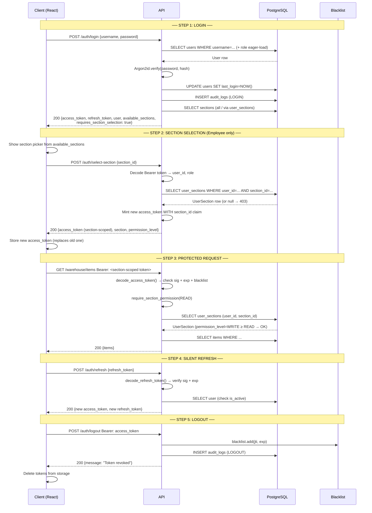

# Factory Management System — Core Security Layer

> **Implementation complete.** All files are live in `d:\SOP Manager\backend\`.

---

## Architecture Overview

```
┌──────────────────────────────────────────────────────────────────────────┐
│                         SECURITY LAYER                                   │
│                                                                          │
│  core/security.py      ← Argon2id hashing + JWT + FastAPI dependencies  │
│  middleware/auth_middleware.py  ← Section-level permission gate          │
│  utils/token_blacklist.py      ← In-memory JTI revocation store         │
│  services/auth_service.py      ← All auth business logic                │
│  routers/auth.py               ← HTTP endpoints (thin adapter)          │
│  schemas/auth.py               ← Request/response Pydantic models       │
└──────────────────────────────────────────────────────────────────────────┘
```

---

## 1. Password Hashing (Argon2id)

**Algorithm:** Argon2id — winner of the Password Hashing Competition (2015)  
**Why Argon2id over bcrypt?** Resistant to both side-channel attacks (Argon2i) and GPU brute-force (Argon2d).

```python
# core/security.py
_hasher = PasswordHasher(
    time_cost    = 2,       # CPU iterations
    memory_cost  = 65536,   # 64 MB RAM per hash → GPU cracking is expensive
    parallelism  = 2,       # parallel threads
)
```

| Operation | Function | Notes |
|-----------|----------|-------|
| Hash | `hash_password(plain)` | Returns `$argon2id$...` string |
| Verify | `verify_password(plain, hash)` | Constant-time, returns bool |
| Rehash | `needs_rehash(hash)` | True if params changed — upgrade on next login |

> [!IMPORTANT]
> Plain-text passwords are **never stored, logged, or returned** anywhere in the codebase.

---

## 2. JWT Token Design

### Claims Structure

```json
// Access Token
{
  "sub":        "550e8400-e29b-41d4-a716-446655440000",  // user UUID
  "role":       "EMPLOYEE",                               // RBAC role
  "type":       "access",
  "section_id": "00000000-0000-0000-0002-000000000003",  // set after select-section
  "iat":        1750424400,                               // issued at
  "exp":        1750426200,                               // expires at (+30 min)
  "jti":        "f3a1d2e0-...",                           // unique ID (revocation)
}

// Refresh Token (separate secret)
{
  "sub":  "550e8400-...",
  "type": "refresh",
  "iat":  1750424400,
  "exp":  1751029200,   // +7 days
  "jti":  "a7b2c3d4-..."
}
```

| Claim | Purpose |
|-------|---------|
| `sub` | User identity — UUID string |
| `role` | RBAC gate — checked by `require_role()` |
| `section_id` | Section gate — embedded after `/select-section` |
| `jti` | Per-token unique ID — used for logout revocation |
| `type` | Prevents refresh tokens being used as access tokens |

### Token Secrets
- **Access** token: `SECRET_KEY` (short-lived, 30 min)
- **Refresh** token: `REFRESH_SECRET_KEY` (long-lived, 7 days, **different secret**)

> [!WARNING]
> If `SECRET_KEY` leaks, attackers can forge access tokens. `REFRESH_SECRET_KEY` is a separate line of defense so a leaked access secret doesn't compromise refresh tokens.

---

## 3. Complete Auth Flow



---

## 4. Authorization Decision Chain

Every section-protected request goes through this chain:

```
Request arrives with Bearer token
         │
         ▼
┌─────────────────────────┐
│ 1. decode_access_token() │  ← Signature OK? Expired? Blacklisted?
└────────────┬────────────┘       ✗ → 401 Unauthorized
             │ ✓
             ▼
┌─────────────────────────┐
│ 2. role == "ADMIN"?      │  ← Admins bypass section checks
└────────────┬────────────┘       ✓ → Allow immediately
             │ ✗ (EMPLOYEE)
             ▼
┌─────────────────────────┐
│ 3. section_id in token?  │  ← Employee must call /select-section first
└────────────┬────────────┘       ✗ → 403 "Select section first"
             │ ✓
             ▼
┌─────────────────────────┐
│ 4. user_sections query   │  ← Does the user actually have access?
└────────────┬────────────┘       ✗ → 403 "No access to this section"
             │ ✓ (row found)
             ▼
┌─────────────────────────┐
│ 5. permission_level ≥    │  ← Is the level sufficient for this action?
│   min_level?             │       READ(0) < WRITE(1) < ADMIN(2)
└────────────┬────────────┘       ✗ → 403 "Requires WRITE permission"
             │ ✓
             ▼
         ALLOWED → Business logic executes
```

---

## 5. Token Blacklist (Logout Support)

```python
# utils/token_blacklist.py — singleton in-memory store
blacklist = TokenBlacklist()   # dict[jti → expires_at]

# On logout:
blacklist.add(jti, expires_at)   # O(1)

# On every decode:
if blacklist.is_blacklisted(jti):   # O(1)
    raise 401
```

| Feature | MVP (Current) | Production Upgrade |
|---------|--------------|-------------------|
| Storage | In-memory dict | Redis SETEX(jti, ttl, "1") |
| Persistence | Lost on restart | Survives restarts |
| Multi-process | ❌ Not shared | ✅ Shared across workers |
| TTL cleanup | Auto-purge on access | TTL handled by Redis |

---

## 6. API Contract

### `POST /api/v1/auth/login`
```json
// Request
{ "username": "ahmed_ali", "password": "Employee@1234" }

// Response 200
{
  "status": "success",
  "data": {
    "access_token": "<JWT>",
    "refresh_token": "<JWT>",
    "token_type": "bearer",
    "expires_in": 1800,
    "user": { "id": "...", "username": "ahmed_ali", "role": "EMPLOYEE" },
    "available_sections": [
      { "id": "...", "name": "Warehouse", "permission_level": "WRITE" }
    ],
    "requires_section_selection": true
  }
}
```

### `POST /api/v1/auth/select-section`
```json
// Request (Bearer: access_token from login)
{ "section_id": "00000000-0000-0000-0002-000000000003" }

// Response 200
{
  "status": "success",
  "data": {
    "access_token": "<NEW JWT with section_id embedded>",
    "token_type": "bearer",
    "section": { "id": "...", "name": "Warehouse", "description": "..." },
    "permission_level": "WRITE",
    "message": "Active section set to 'Warehouse'."
  }
}
```

### `POST /api/v1/auth/logout`
```
// Request: Bearer <access_token>
// Response 200
{ "status": "success", "data": { "message": "Logged out successfully. Token has been revoked." } }
// Subsequent use of the same token → 401
```

### `GET /api/v1/auth/me`
```json
{
  "status": "success",
  "data": {
    "id": "...",
    "username": "ahmed_ali",
    "role": "EMPLOYEE",
    "is_active": true,
    "active_section_id": "...uuid...",
    "available_sections": [...],
    "requires_section_selection": false
  }
}
```

---

## 7. Protecting Routes

```python
# ── Role only (no section) ────────────────────────────────────────────────
from app.core.security import require_role

@router.get("/admin-panel", dependencies=[Depends(require_role("ADMIN"))])
async def admin_panel(): ...

# ── Section permission (READ) ─────────────────────────────────────────────
from app.middleware.auth_middleware import section_read_required

@router.get("/documents/section/{id}", dependencies=[Depends(section_read_required)])
async def list_docs(id: uuid.UUID): ...

# ── Section permission (WRITE) + get user_id ─────────────────────────────
from app.middleware.auth_middleware import section_write_required

@router.post("/warehouse/items")
async def create_item(
    body: ItemCreateRequest,
    token: dict = Depends(section_write_required),   # returns payload
):
    user_id = uuid.UUID(token["sub"])

# ── Full user object ──────────────────────────────────────────────────────
from app.core.security import get_current_user

@router.get("/profile")
async def profile(user: User = Depends(get_current_user)):
    return {"username": user.username, "role": user.role.name}
```

---

## 8. Quick Start

```bash
cd "d:\SOP Manager\backend"

# 1. Set up and start
copy .env.example .env      # edit DATABASE_URL and secrets
pip install -r requirements.txt
psql -U postgres -d factory_db -f ..\database\schema.sql
psql -U postgres -d factory_db -f ..\database\seed.sql
uvicorn app.main:app --reload

# 2. Open API docs
# http://localhost:8000/api/docs

# 3. Run the auth flow test
python test_auth_flow.py    # expects: ALL 13 TESTS PASSED ✓
```
